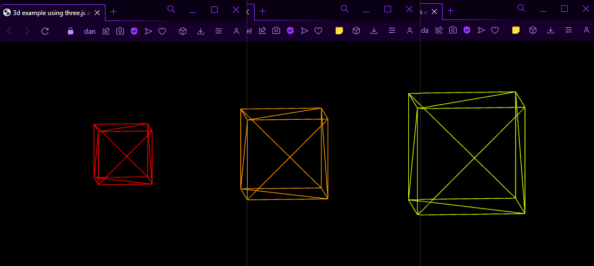

## 3d scene spanning multiple windows using three.js and localStorage

A simple example showing how to setup a 3d scene across windows on the same origin using three.js and localStorage. Code should be self explanatory

 
Preview: 
<a href="https://danielvneitzel.github.io/multipleWindow3dScene/" target="_blank">
  https://danielvneitzel.github.io/multipleWindow3dScene/
</a>
